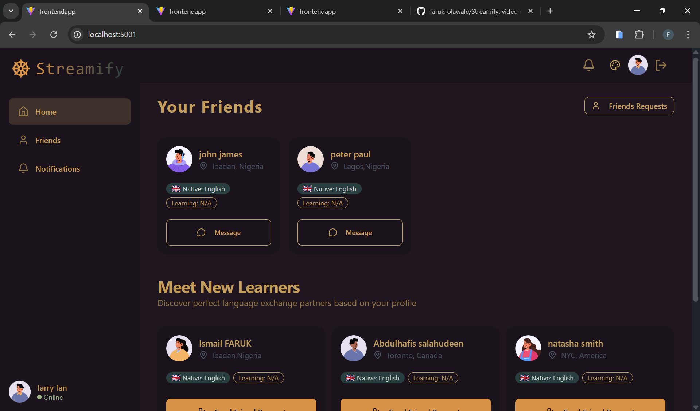

# 🌍 Streamify - Language Exchange Platform

<div align="center">


**Connect. Learn. Speak.**

A modern platform for language learners to connect, practice, and grow together through real-time video calls and messaging.

[Live Demo](https://streamify-nfyw.onrender.com/) | [Report Bug](https://github.com/faruk-olawale/Streamify/issues) | [Request Feature](https://github.com/faruk-olawale/Streamify/issues)

</div>

---

## 📋 Table of Contents

- [About The Project](#about-the-project)
- [Features](#features)
- [Tech Stack](#tech-stack)
- [Getting Started](#getting-started)
- [Installation](#installation)
- [Environment Variables](#environment-variables)
- [Usage](#usage)
- [API Documentation](#api-documentation)
- [Contributing](#contributing)
- [License](#license)
- [Contact](#contact)

---

## 🎯 About The Project

Streamify is a comprehensive language exchange platform that connects language learners from around the world. Whether you're learning Spanish, French, Japanese, or any other language, Streamify helps you find the perfect language partner to practice with through video calls and text messaging.

### 📸 Screenshots

<div align="center">

#### 🏠 Homepage - Your Friends & Recommendations

*Connect with language learners and discover new friends based on your language preferences*

#### 🔔 Notifications - Friend Requests & New Connections

*Stay updated with incoming friend requests and see who accepted your requests*

#### 💬 Real-Time Chat

*Practice languages through instant messaging with typing indicators and online status*

</div>

### Why Streamify?

- 🌐 **Global Community**: Connect with language learners worldwide
- 🎥 **Real-Time Video Calls**: Practice speaking with native speakers via high-quality video
- 💬 **Instant Messaging**: Chat with language partners anytime
- 🔔 **Smart Notifications**: Get notified when someone accepts your friend request
- 👥 **Personalized Matching**: Find partners based on your native and learning languages
- 🎨 **Modern UI/UX**: Beautiful, responsive design that works on all devices

---

## ✨ Features

### 🔐 Authentication & Onboarding
- Secure user registration and login
- Personalized onboarding flow
- Profile customization with bio, languages, and location

### 👫 Social Features
- **Friend System**: Send and accept friend requests
- **Smart Recommendations**: Get matched with learners based on language compatibility
- **Friend Management**: View all your language exchange partners
- **Real-time Notifications**: Stay updated on friend requests and acceptances

### 💬 Communication
- **Text Messaging**: Real-time chat powered by Stream Chat
- **Video Calls**: High-quality video conversations using Stream Video SDK
- **Call Controls**: Mute, unmute, video on/off, and hang up controls

### 🎨 User Experience
- **Responsive Design**: Works seamlessly on desktop, tablet, and mobile
- **Dark/Light Mode**: Theme support for comfortable viewing
- **Language Flags**: Visual representation of languages with country flags
- **Profile Cards**: Beautiful user cards showing bio, languages, and location

---

## 🛠️ Tech Stack

### Frontend
- **React 18** - UI library
- **React Router** - Navigation
- **TanStack Query (React Query)** - Data fetching and caching
- **Stream Chat React** - Real-time messaging
- **Stream Video React SDK** - Video calling
- **Tailwind CSS** - Styling
- **DaisyUI** - UI components
- **Lucide React** - Icons
- **React Hot Toast** - Notifications
- **Axios** - HTTP client

### Backend
- **Node.js** - Runtime environment
- **Express.js** - Web framework
- **MongoDB** - Database
- **Mongoose** - ODM
- **JWT** - Authentication
- **Stream API** - Chat and video infrastructure
- **Bcrypt** - Password hashing
- **Cookie Parser** - Cookie management
- **CORS** - Cross-origin resource sharing

### Deployment
- **Frontend**: Render
- **Backend**: Render
- **Database**: MongoDB Atlas

---

## 🚀 Getting Started

### Prerequisites

Make sure you have the following installed:
- **Node.js** (v16 or higher)
- **npm** or **yarn**
- **MongoDB** (local or Atlas account)
- **Stream Account** (for chat and video features)

### Installation

1. **Clone the repository**
   ```bash
   git clone https://github.com/faruk-olawale/Streamify.git
   cd streamify
   ```

2. **Install Backend Dependencies**
   ```bash
   cd Backend
   npm install
   ```

3. **Install Frontend Dependencies**
   ```bash
   cd ../Frontend
   npm install
   ```

4. **Set up Environment Variables**

   Create a `.env` file in the `Backend` directory:
   ```env
   PORT=5001
   MONGO_URI=your_mongodb_connection_string
   JWT_SECRET=your_jwt_secret_key
   NODE_ENV=development
   STREAM_API_KEY=your_stream_api_key
   STREAM_SECRET_KEY=your_stream_secret_key
   CLIENT_URL=http://localhost:5173
   ```

   Create a `.env` file in the `Frontend` directory:
   ```env
   VITE_API_URL=http://localhost:5001
   VITE_STREAM_API_KEY=your_stream_api_key
   ```

5. **Run the Application**

   Start the backend server:
   ```bash
   cd Backend
   npm start
   ```

   Start the frontend development server:
   ```bash
   cd Frontend
   npm run dev
   ```

6. **Access the Application**
   - Frontend: `http://localhost:5173`
   - Backend API: `http://localhost:5001`

---

## 🔑 Environment Variables

### Backend Environment Variables

| Variable | Description | Required |
|----------|-------------|----------|
| `PORT` | Server port | Yes |
| `MONGO_URI` | MongoDB connection string | Yes |
| `JWT_SECRET` | Secret key for JWT tokens | Yes |
| `NODE_ENV` | Environment (development/production) | Yes |
| `STREAM_API_KEY` | Stream API key | Yes |
| `STREAM_SECRET_KEY` | Stream secret key | Yes |
| `CLIENT_URL` | Frontend URL for CORS | Yes |

### Frontend Environment Variables

| Variable | Description | Required |
|----------|-------------|----------|
| `VITE_API_URL` | Backend API URL | Yes |
| `VITE_STREAM_API_KEY` | Stream API key | Yes |

---

## 📖 Usage

### 1. Sign Up
- Create an account with your email and password
- Complete the onboarding process by adding your profile details

### 2. Set Up Your Profile
- Add a bio describing yourself
- Select your native language(s)
- Choose the language(s) you want to learn
- Add your location

### 3. Find Language Partners
- Browse recommended users based on language compatibility
- View user profiles with bio, languages, and location
- Send friend requests to connect

### 4. Start Conversations
- Accept incoming friend requests
- Message your language partners in real-time
- Start video calls for speaking practice

### 5. Manage Your Network
- View all your friends in one place
- Get notifications when requests are accepted
- Track your language learning journey

---

## 📡 API Documentation

### Authentication Endpoints

#### POST `/api/auth/signup`
Register a new user
```json
{
  "fullName": "John Doe",
  "email": "john@example.com",
  "password": "password123"
}
```

#### POST `/api/auth/login`
Login existing user
```json
{
  "email": "john@example.com",
  "password": "password123"
}
```

#### POST `/api/auth/logout`
Logout current user

#### GET `/api/auth/me`
Get current authenticated user

#### POST `/api/auth/onboarding`
Complete user onboarding
```json
{
  "bio": "Language enthusiast",
  "nativeLanguages": ["English"],
  "learningLanguages": ["Spanish"],
  "location": "New York, USA"
}
```

### User Endpoints

#### GET `/api/users`
Get recommended users

#### GET `/api/users/friends`
Get user's friends list

#### GET `/api/users/friend-requests`
Get incoming and accepted friend requests

#### GET `/api/users/outgoing-friend-requests`
Get outgoing friend requests

#### POST `/api/users/friend-requests/:id`
Send a friend request

#### PUT `/api/users/friend-requests/:id/accept`
Accept a friend request

### Stream Endpoints

#### GET `/api/stream/token`
Get Stream API token for chat and video

---

## 🤝 Contributing

Contributions are what make the open-source community such an amazing place to learn, inspire, and create. Any contributions you make are **greatly appreciated**.

1. Fork the Project
2. Create your Feature Branch (`git checkout -b feature/AmazingFeature`)
3. Commit your Changes (`git commit -m 'Add some AmazingFeature'`)
4. Push to the Branch (`git push origin feature/AmazingFeature`)
5. Open a Pull Request

---

## 📝 License

Distributed under the MIT License. See `LICENSE` for more information.

---

## 👨‍💻 Contact

**Faruk Olawale** - farukolawale509@gmail.com

Project Link: [https://github.com/faruk-olawale/Streamify](https://github.com/faruk-olawale/Streamify)

Live Demo: [https://streamify-nfyw.onrender.com/](https://streamify-nfyw.onrender.com/)

---

## 🙏 Acknowledgments

- [Stream](https://getstream.io/) - For chat and video infrastructure
- [MongoDB Atlas](https://www.mongodb.com/cloud/atlas) - For database hosting
- [Render](https://render.com/) - For deployment
- [Tailwind CSS](https://tailwindcss.com/) - For styling
- [Lucide Icons](https://lucide.dev/) - For beautiful icons
- [Flag CDN](https://flagcdn.com/) - For country flags

---

<div align="center">

**Made with ❤️ by Faruk Olawale**

⭐ Star this repo if you find it helpful!

</div>